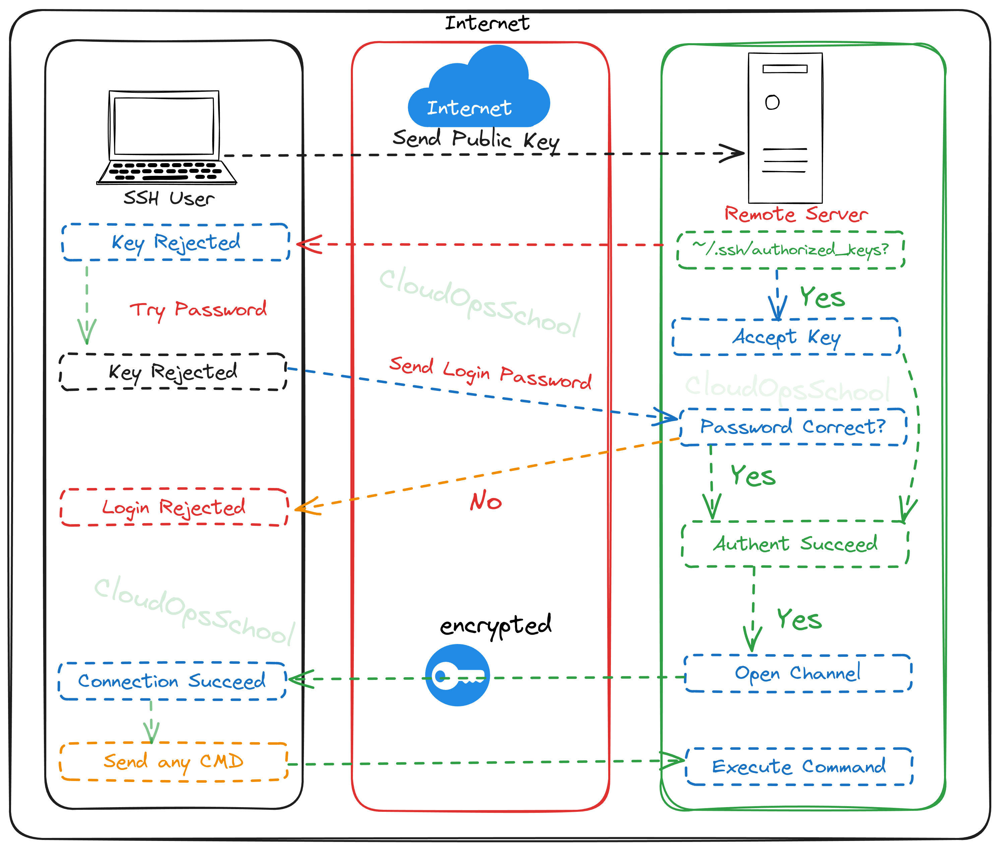

<h2>SSH keys based authentication configuration with Custom Host</h2>

**Tables of Contents**
- [Authentication methods](#authentication-methods)
- [Advantages of Public Key Authentication:](#advantages-of-public-key-authentication)
  - [Best Practices for Public Key Authentication:](#best-practices-for-public-key-authentication)
- [Step 1: Generate SSH Key Pair](#step-1-generate-ssh-key-pair)
- [Step 2: Copy Public Key to Remote Host](#step-2-copy-public-key-to-remote-host)
- [Step 3: Test SSH Connection](#step-3-test-ssh-connection)
- [Step 4: Optional - Create SSH Config File](#step-4-optional---create-ssh-config-file)
- [Step 5: Connect Using SSH Config](#step-5-connect-using-ssh-config)

### Authentication methods
SSH supports two authentication methods:
  - Public key
  - Password
  
Public key authentication is a method of logging into an SSH/SFTP account using a cryptographic key pair rather than a password. This method provides a more secure way of authenticating compared to password-based authentication.

**Here's how it works:**

1. **Key Generation**: First, you generate a key pair on your local machine - a public key and a private key. The private key is kept secret on your local machine, while the public key can be shared freely.

2. **Public Key Placement**: You place the public key on the server you want to connect to. This is typically done by appending the contents of your public key file to the `~/.ssh/authorized_keys` file on the server.

3. **Authentication**: When you attempt to connect to the server, your SSH client sends your public key to the server. The server checks if this public key is listed in the `authorized_keys` file. If it finds a matching public key, it generates a challenge using the public key and sends it to your client.

4. **Private Key Usage**: Your SSH client then uses your private key to decrypt the challenge and sends the decrypted response back to the server. If the server successfully decrypts the response using the corresponding public key, you are granted access.

### Advantages of Public Key Authentication:

- **Enhanced Security**: Public key authentication eliminates the need to transmit passwords over the network, reducing the risk of password interception.

- **Convenience**: Once set up, public key authentication can offer a more seamless login experience compared to entering passwords, especially if you use SSH frequently.

- **Automation**: Public key authentication can be easily integrated into automated scripts and processes, allowing for secure, passwordless authentication in various scenarios.

#### Best Practices for Public Key Authentication:

- **Protect Your Private Key**: Keep your private key secure and never share it with anyone else. Use passphrase protection for added security.

- **Regular Key Rotation**: Periodically rotate your SSH keys to mitigate the risk of key compromise.

- **Limited Access**: Only grant access to authorized users by adding their public keys to the `authorized_keys` file on the server.

By using public key authentication, you can significantly enhance the security of your SSH connections while also streamlining the authentication process.

<p align="center">
  
  <br/>
  Pic: ssh-authentication Architecture
</p>


### Step 1: Generate SSH Key Pair
Open a terminal on your local machine and run the following command:\
`ssh-keygen -t rsa -b 2048`

### Step 2: Copy Public Key to Remote Host
Assuming your remote host is running a Unix-like operating system, you can use the ssh-copy-id command to copy your public key to the remote host. Replace "username" and "hostname" with your actual remote username and hostname/IP.\
`ssh-copy-id username@hostname`\

This command adds your public key to the ~/.ssh/authorized_keys file on the remote host.

### Step 3: Test SSH Connection
Try to SSH into the remote host\
`ssh username@hostname`

### Step 4: Optional - Create SSH Config File
To simplify connections, you can create an SSH config file (~/.ssh/config) on your local machine. Edit the file with a text editor.\
`vim ~/.ssh/config`

Add the following lines, replacing "hostname" with your remote host's address and "key" with the path to your private key.\

```
Host myhost
  HostName hostname/ip
  User username
  Port 5439
  IdentityFile ~/.ssh/key

```
### Step 5: Connect Using SSH Config
Now you can connect to your remote host using the configured alias:\
`ssh myhost`


